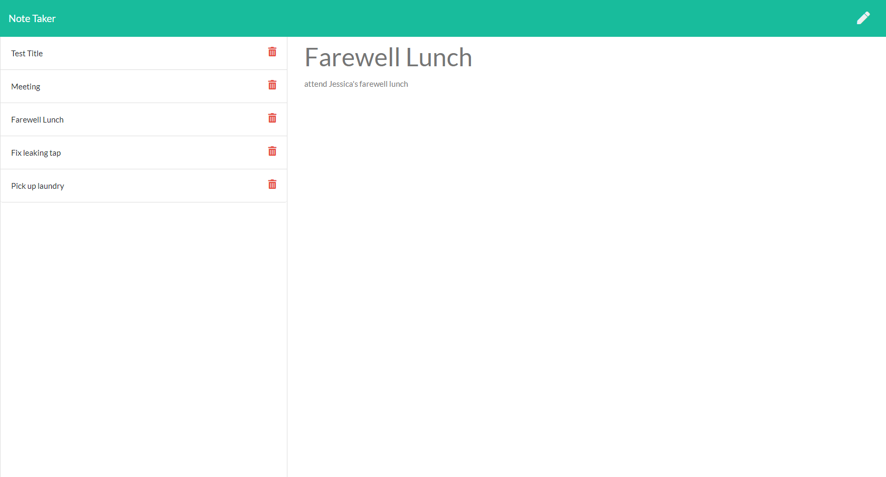

# 11. Express JS : Note Taker

### Table of Contents

- [Description](#description)
- [Installation](#installation)
- [Usage](#usage)
- [Contribution](#contribution)
- [License](#license)

## Description

This project lets users write and save notes. The user can keep track of tasks needed to complete. This helps user to organize the day. The user can also delete completed task. This application uses express.js back end.

## Installation

- First you have to clone the repo in your local machine
- Then run command 'npm i' to install all necessary dependencies
- Then run command 'node server.js', it will start localhost server on port 8080
- To run on the browser, use 'http://localhost:3000/' in URL

## Usage

- When the application is opened it is presented with landing page with a link to create a new note.
- When that link is clicked then it takes to the page where user can enter note title and description. The user can save the note.
- On the left handside of the page, the list of notes are displayed with delete icon.
- If user clicks on one of the note, then note details are displayed.
- If user clicks on delete icon, then the selected note is deleted.

## Mockup

## Contribution

Please feel free in making contribution to this repository. But please first discuss the change via email with me. I will try to get back to you as soon as possible.

## Questions

If you have any questions feel free to contact me:

Github Username: sona29

Email: sona.shrestha004@gmail.com

## License

